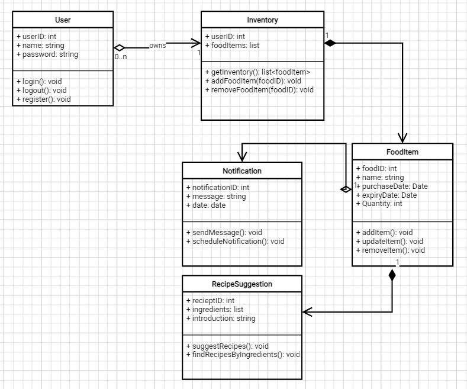

# [G22 - Team Name] Report

The following is a report template to help your team successfully provide all the details necessary for your report in a structured and organised manner. Please give a straightforward and concise report that best demonstrates your project. Note that a good report will give a better impression of your project to the reviewers.

Note that you should have removed ALL TEMPLATE/INSTRUCTION textes in your submission (like the current sentence), otherwise it hampers the professionality in your documentation.

*Here are some tips to write a good report:*

* `Bullet points` are allowed and strongly encouraged for this report. Try to summarise and list the highlights of your project (rather than give long paragraphs).*

* *Try to create `diagrams` for parts that could greatly benefit from it.*

* *Try to make your report `well structured`, which is easier for the reviewers to capture the necessary information.*

*We give instructions enclosed in square brackets [...] and examples for each sections to demonstrate what are expected for your project report. Note that they only provide part of the skeleton and your description should be more content-rich. Quick references about markdown by [CommonMark](https://commonmark.org/help/)*

## Table of Contents

1. [Team Members and Roles](#team-members-and-roles)
2. [Summary of Individual Contributions](#summary-of-individual-contributions)
3. [Application Description](#application-description)
4. [Application UML](#application-uml)
5. [Application Design and Decisions](#application-design-and-decisions)
6. [Summary of Known Errors and Bugs](#summary-of-known-errors-and-bugs)
7. [Testing Summary](#testing-summary)
8. [Implemented Features](#implemented-features)
9. [Team Meetings](#team-meetings)
10. [Conflict Resolution Protocol](#conflict-resolution-protocol)

## Administrative
- Firebase Repository Link: <insert-link-to-firebase-repository>
   - Confirm: I have already added comp21006442@gmail.com as a Developer to the Firebase project prior to due date.
- Two user accounts for markers' access are usable on the app's APK (do not change the username and password unless there are exceptional circumstances. Note that they are not real e-mail addresses in use):
   - Username: comp2100@anu.edu.au	Password: comp2100
   - Username: comp6442@anu.edu.au	Password: comp6442

## Team Members and Roles
The key area(s) of responsibilities for each member

| UID   |  Name  |   Role |
|:------|:------:|-------:|
| [u7770074] | [Baizhen Lin] | [role] |
| [u7705332] | [Diming Xu] | [role] |
| [u7709381] | [Yue Yu] | [role] |
| [u7619253] | [Zhongyi Ding] | [role] |
| [u7174903] | [Zihan Jian] | [role] |

## Summary of Individual Contributions

Specific details of individual contribution of each member to the project.

Each team member is responsible for writing **their own subsection**.

A generic summary will not be acceptable and may result in a significant lose of marks.

*[Summarise the contributions made by each member to the project, e.g. code implementation, code design, UI design, report writing, etc.]*

*[Code Implementation. Which features did you implement? Which classes or methods was each member involved in? Provide an approximate proportion in pecentage of the contribution of each member to the whole code implementation, e.g. 30%.]*

*you should ALSO provide links to the specified classes and/or functions*
Note that the core criteria of contribution is based on `code contribution` (the technical developing of the App).

*Here is an example: (Note that you should remove the entire section (e.g. "others") if it is not applicable)*

1. **UID1, Name1**  I have 30% contribution, as follows:  
  - **Code Contribution in the final App**
    - Feature A1, A2, A3 - class Dummy: [Dummy.java](https://gitlab.cecs.anu.edu.au/comp2100/group-project/ga-23s2/-/blob/main/items/media/_examples/Dummy.java)
    - XYZ Design Pattern -  class AnotherClass: [functionOne()](https://gitlab.cecs.anu.edu.au/comp2100/group-project/ga-23s2/-/blob/main/items/media/_examples/Dummy.java#L22-43), [function2()](the-URL)
    - ... (any other contribution in the code, including UI and data files) ... [Student class](../src/path/to/class/Student.java), ..., etc.*, [LanguageTranslator class](../src/path/to/class/LanguageTranslator.java): function1(), function2(), ...   

  - **Code and App Design** 
    - [What design patterns, data structures, did the involved member propose?]*
    - [UI Design. Specify what design did the involved member propose? What tools were used for the design?]*   

  - **Others**: (only if significant and significantly different from an "average contribution") 
    - [Report Writing?] [Slides preparation?]*
    - [You are welcome to provide anything that you consider as a contribution to the project or team.] e.g., APK, setups, firebase*   

2. **UID2, Name2**  I have xx% contribution, as follows:  
  - ...

## Application Description

*[What is your application, what does it do? Include photos or diagrams if necessary]*

*FeastForward*

*FeastForward is an Android application designed to bridge the gap between food surplus and scarcity by facilitating the donation and distribution of food. Our app ensures that excess food reaches those who need it most, supports users in checking the expiration of food items, and helps in discovering new recipes to transform leftover ingredients into delicious meals.*

### Application Use Cases and or Examples

*[Provide use cases and examples of people using your application. Who are the target users of your application? How do the users use your application?]*

*Jack wants to know which food he owns is about to expire, and how he can cook this food.*
1. *Jack finds the potato will expire on 2024/5/20*
2. *Jack finds recipes for potatoes, and finds one recipe*
3. *Jack finds other users would share their foods to help him use in this recipe*
4. *If there are still potatoes left, Jack can mark them and share them to other people*

*Targets Users: People live in the same community or dorm*

* **
* **
* ...

*List all the use cases in text descriptions or create use case diagrams. Please refer to https://www.visual-paradigm.com/guide/uml-unified-modeling-language/what-is-use-case-diagram/ for use case diagram.*

 

### Application UML

  
*[Replace the above with a class diagram. You can look at how we have linked an image here as an example of how you can do it too.]*

## Code Design and Decisions

This is an important section of your report and should include all technical decisions made. Well-written justifications will increase your marks for both the report as well as for the relevant parts (e.g., data structure). This includes, for example,

- Details about the parser (describe the formal grammar and language used)

- Decisions made (e.g., explain why you chose one or another data structure, why you used a specific data model, etc.)
1. *The search recipe function uses an ArrayList to store large quantities of recipes from .JSON and .CSV files, it is simple to compute and it could be memory-intensive with very large datasets and fast access times, so a new thread was created to make it work in the background.*
2. *Implementing a method to calculate the similarity between the user's input and ingredients in the dataset using the edit distance algorithm, so the application can perform fuzzy matching of ingredients.
allows for more flexible searches, accommodating minor typos or different spellings in ingredient names.*
3. *The ExpiredFoodAlert function manages food expiry data with dynamic loading (use userID) and responsive Toast messages.*

- Details about the design patterns used (where in the code, justification of the choice, etc)

*Please give clear and concise descriptions for each subsections of this part. It would be better to list all the concrete items for each subsection and give no more than `5` concise, crucial reasons of your design.

### Data Structures

*[What data structures did your team utilise? Where and why?]*

Here is a partial (short) example for the subsection `Data Structures`:*

*I used the following data structures in my project:*

1. *LinkedList*
   * *Objective: used for storing xxxx for xxx feature.*
   * *Code Locations: defined in [Class X, methods Z, Y](https://gitlab.cecs.anu.edu.au/comp2100/group-project/ga-23s2/-/blob/main/items/media/_examples/Dummy.java#L22-43) and [class AnotherClass, lines l1-l2](url); processed using [dataStructureHandlerMethod](url) and ...
   * *Reasons:*
      * *It is more efficient than Arraylist for insertion with a time complexity O(1)*
      * *We don't need to access the item by index for xxx feature because...*
      * For the (part), the data ... (characteristics) ...

2. *Binary Search Tree*
   * *Objective: The binary search tree (BST) was used for storing and organizing food items by their expiry dates to support efficient retrieval, insertion, and traversal operations, particularly for the feature of displaying food items in order of expiry.*
   * *Code Locations: defined in [Class TreeNode](https://gitlab.cecs.anu.edu.au/u7705332/gp-24s1/-/blob/main/Project/app/src/main/java/com/example/myapplication/Tree/TreeNode.java?ref_type=heads) and [Class BinarySearchTree](https://gitlab.cecs.anu.edu.au/u7705332/gp-24s1/-/blob/main/Project/app/src/main/java/com/example/myapplication/Tree/BinarySearchTree.java?ref_type=heads)*
   *  *Reasons:*
      *  *Efficiency: The BST allows for efficient insertion and retrieval of food items based on their expiry dates. Insertion and search operations have an average time complexity of O(log n), which is more efficient than a linear data structure for the large datasets expected in this application.*
      *	*Order Maintenance: The in-order traversal of a BST naturally produces items in ascending order, which is particularly useful for displaying food items by their expiry dates.*
      *	*Flexibility: The hierarchical structure of the BST supports dynamic insertion and deletion of food items without the need for reorganization of the entire dataset, which is ideal for the app's requirement to frequently update the food inventory.*
      *	*Insertion: Each food item is inserted into the BST based on its expiry date, ensuring that the tree remains balanced for optimal performance.*
      *	*Traversal: The BST is traversed in order to display food items in ascending order of their expiry dates, providing a clear and organized view for users.*
      *	*Scalability: The BST structure can handle large datasets efficiently, making it suitable for applications with a substantial number of food items.*

3. ...

### Design Patterns
*[What design patterns did your team utilise? Where and why?]*

1. *xxx Pattern*
   * *Objective: used for storing xxxx for xxx feature.*
   * *Code Locations: defined in [Class X, methods Z, Y](https://gitlab.cecs.anu.edu.au/comp2100/group-project/ga-23s2/-/blob/main/items/media/_examples/Dummy.java#L22-43) and [class AnotherClass, lines l1-l2](url); processed using [dataStructureHandlerMethod](url) and ...
   * *Reasons:*
      * ...

### Parser

### <u>Grammar(s)</u>
*[How do you design the grammar? What are the advantages of your designs?]*
*If there are several grammars, list them all under this section and what they relate to.*

Production Rules:

    <Non-Terminal> ::= <some output>
    <Non-Terminal> ::= <some output>

### <u>Tokenizers and Parsers</u>

*[Where do you use tokenisers and parsers? How are they built? What are the advantages of the designs?]*

### Others

*[What other design decisions have you made which you feel are relevant? Feel free to separate these into their own subheadings.]*

 

## Implemented Features
*[What features have you implemented? where, how, and why?]*  
*List all features you have completed in their separate categories with their featureId. THe features must be one of the basic/custom features, or an approved feature from Voice Four Feature.*

### Basic Features
1. [LogIn]. Description of the feature ... (easy)
   * Code: [Class X, methods Z, Y](https://gitlab.cecs.anu.edu.au/comp2100/group-project/ga-23s2/-/blob/main/items/media/_examples/Dummy.java#L22-43) and Class Y, ...
   * Description of feature: ...  
   * Description of your implementation: ...  

2. [DataFiles]. Description  ... ... (...)
   * Code to the Data File [users_interaction.json](link-to-file), [search-queries.xml](link-to-file), ...
   * Link to the Firebase repo: ...

3. [LoadShowData]...

4. [DataStream] Create data instances to simulate users’ actions and interactions, which are then used
to feed the app so that when a user is logged in, these data are loaded at regular time intervals and
visualised on the app. (medium)
   * Code: [Class FoodDataManager](https://gitlab.cecs.anu.edu.au/u7705332/gp-24s1/-/blob/main/Project/app/src/main/java/com/example/myapplication/FoodDataManager.java?ref_type=heads)
   * Description of feature: 
      * User Data Retrieval: Retrieves the food data entries specific to the current user.
      *	Shared Data Retrieval: Retrieves the food data entries that have been shared by other users.
      *	Near Expiry Items Retrieval: Identifies food items that are near their expiry dates.
      *	Food Item Update: Updates the shared status of a food item for the current user.
      *	Food Item Deletion: Deletes a specific food item from the user's food data.  
   * Description of your implementation:
      *	User Data Retrieval: Implemented a method that reads food data from a CSV file and filters entries based on the current user ID. This method uses a BufferedReader provided by the ReaderProvider interface to read the file.
      *	Near Expiry Items Retrieval: Developed a method that calculates the time difference between the current date and the expiry dates of the food items. It identifies items that are due to expire within the next three days. This method uses the SimpleDateFormat class to parse dates.
      *	Food Item Update: Created a method that reads the CSV file, updates the shared status of a specified food item, and writes the changes back to the file using a BufferedWriter provided by the WriterProvider interface.
      *	Food Item Deletion: Developed a method that reads the CSV file, removes a specified food item, and writes the remaining data back to the file using a BufferedWriter provided by the WriterProvider interface.
      *	Interfaces for File I/O: Defined ReaderProvider and WriterProvider interfaces to provide BufferedReader and BufferedWriter instances. Implemented default providers that use java.io.FileReader and java.io.FileWriter.  

5. [Search]...
    

### Custom Features
Feature Category: Search-related features  
1. [Search-Filter]. Description of the feature  (easy)
   * Code: [Class X, methods Z, Y](https://gitlab.cecs.anu.edu.au/comp2100/group-project/ga-23s2/-/blob/main/items/media/_examples/Dummy.java#L22-43) and Class Y, ...
   * Description of your implementation: ...  
      

2. [ ]. Description ... ... (medium)
   ... ...
     

Feature Category: UI Design and Testing  
3. [UI-Layout] Description of the feature (easy)
   * Code: [Class X, entire file](https://gitlab.cecs.anu.edu.au/comp2100/group-project/ga-23s2/-/blob/main/items/media/_examples/Dummy.java#L22-43) and Class Y, ...
   * [Class B](../src/path/to/class/file.java#L30-85): methods A, B, C, lines of code: 30 to 85
   * Description of your implementation: ...  

Feature Category: Greater Data Usage, Handling and Sophistication  
4. [Data-Formats] Read recipes from .JSON and .CSV file (easy)
 
5. [Data-Profile] Give every user a profile after login (easy)
 

Feature Category: User Interactivity  
6. [Interact-Share] The ability to share an item with another user via private message or other channels
within the App. [stored in-memory]. (easy)
   * code: [Class FoodExpiredAlert](https://gitlab.cecs.anu.edu.au/u7705332/gp-24s1/-/blob/main/Project/app/src/main/java/com/example/myapplication/ExpiredFoodAlert.java?ref_type=heads)
   * Description of your implementation: When a user selects a specific food item to share, the shared food item is stored in-memory. Other users can then retrieve this shared food data from the in-memory storage. The shared food items are displayed in the shared food table by calling the populateSharedTable and addSharedRowToTable methods. The FoodDataManager class handles the storage and retrieval of shared food items through the getSharedData and updateFoodSharedStatus methods, ensuring that shared items are correctly managed and displayed across different users.
    

### Surprise Features

- If implemented, explain how your solution addresses the task (any detail requirements will be released with the surprise feature specifications).
- State that "Suprised feature is not implemented" otherwise.

  

## Summary of Known Errors and Bugs

*[Where are the known errors and bugs? What consequences might they lead to?]*
*List all the known errors and bugs here. If we find bugs/errors that your team does not know of, it shows that your testing is not thorough.*

*Here is an example:*

1. *Bug 1:*
   - *A space bar (' ') in the sign in email will crash the application.*
   - ...

2. *Bug 2:*
3. ...

  

## Testing Summary

*[What features have you tested? What is your testing coverage?]*
*Please provide some screenshots of your testing summary, showing the achieved testing coverage. Feel free to provide further details on your tests.*

*Here is an example:*

1. Tests for Search
   - Code: [TokenizerTest Class, entire file](https://gitlab.cecs.anu.edu.au/comp2100/group-project/ga-23s2/-/blob/main/items/media/_examples/Dummy.java) for the [Tokenizer Class, entire file](https://gitlab.cecs.anu.edu.au/comp2100/group-project/ga-23s2/-/blob/main/items/media/_examples/Dummy.java#L22-43)
   - *Number of test cases: ...*
   - *Code coverage: ...*
   - *Types of tests created and descriptions: ...*

2. Tests for FoodDataManager

   - Code: FoodDataManagerTest Class

   - Number of Test Cases: 16

   - Code Coverage: Line: 72%(100/138) Class: 100%(3/3) Method: 100%(10/10)

   - Types of Tests Created and Descriptions:

      - testGetUserData:
         - Purpose: Verify that the user-specific food data is correctly retrieved.
         - Details: This test checks that the correct number of items are retrieved for a specific user and that the data matches the expected values.

      - testGetSharedData:
         - Purpose: Verify that shared food data is correctly retrieved.
         - Details: This test ensures that the shared food items are correctly filtered and do not include items shared by the current user (userId 1).

      - testGetNearExpiryItems:
         - Purpose: Verify that near-expiry food items are correctly identified.
         - Details: This test uses a different sample CSV data set with adjusted dates to check the near-expiry logic, ensuring that items expiring soon are correctly flagged.

      - testUpdateFoodSharedStatus:
         - Purpose: Verify that the shared status of a food item is correctly updated.
         - Details: This test updates the shared status of a specific food item and checks that the status is correctly reflected in the sample data.

      - testDeleteFoodItem:
         - Purpose: Verify that a food item is correctly deleted.
         - Details: This test deletes a specific food item from the sample data and checks that the item is removed and the remaining data is as expected.

      - testGetUserDataInvalidUser:
         - Purpose: Verify that no data is retrieved for an invalid user ID.
         - Details: This test sets an invalid user ID and checks that no data is returned.

      - testGetNoNearExpiryItems:
         - Purpose: Verify that no items are flagged as near expiry when their dates are far in the future.
         - Details: This test uses a dataset where all expiry dates are beyond the near-expiry threshold.

      - testGetSharedDataIncludesOthers:
         - Purpose: Verify that shared data retrieval includes items shared by other users.
         - Details: This test includes items shared by other users and checks that they are correctly retrieved.

      - testGetUserDataEmpty:
         - Purpose: Verify that no data is retrieved from an empty CSV file.
         - Details: This test uses an empty CSV file to check that no data is returned.

      - testGetUserDataMissingFields:
         - Purpose: Verify that data retrieval handles missing fields correctly.
         - Details: This test includes a row with missing fields to check if the method skips invalid entries.

      - testUpdateFoodSharedStatusNonExisting:
         - Purpose: Verify that updating the shared status of a non-existing food item does not alter existing data.
         - Details: This test attempts to update a non-existing food item and checks that existing data remains unchanged.

      - testDeleteFoodItemNonExisting:
         - Purpose: Verify that deleting a non-existing food item does not alter existing data.
         - Details: This test attempts to delete a non-existing food item and checks that existing data remains unchanged.

      - testDefaultReaderProvider:
         - Purpose: Verify that DefaultReaderProvider correctly reads from a file.
         - Details: This test checks that the DefaultReaderProvider can successfully read from a file and that the data matches the expected values.

      - testDefaultWriterProvider:
         - Purpose: Verify that DefaultWriterProvider correctly writes to a file.
         - Details: This test checks that the DefaultWriterProvider can successfully write to a file and that the data matches the expected values.

      - testDefaultReaderProviderDirectory:
         - Purpose: Verify that DefaultReaderProvider throws an IOException when attempting to read from a directory.
         - Details: This test ensures that an IOException is thrown when the DefaultReaderProvider tries to read from a directory.

      - testDefaultWriterProviderFileNotWritable:
         - Purpose: Verify that DefaultWriterProvider throws an IOException when attempting to write to a read-only file.
         - Details: This test ensures that an IOException is thrown when the DefaultWriterProvider tries to write to a read-only file.

...

  

## Team Management

### Meetings Records
* Link to the minutes of your meetings like above. There must be at least 4 team meetings.
  (each commited within 2 days aftre the meeting)
* Your meetings should also have a reasonable date spanning across Week 6 to 11.*

- *[Team Meeting 1](/meeting1.md)*
- *[Team Meeting 2](/meeting2.md)*
- *[Team Meeting 3](/meeting3.md)*
- *[Team Meeting 4](/meeting4.md)*

### Conflict Resolution Protocol
*[Write a well defined protocol your team can use to handle conflicts. That is, if your group has problems, what is the procedure for reaching consensus or solving a problem?
(If you choose to make this an external document, link to it here)]*

This shall include an agreed procedure for situations including (but not limited to):
- e.g., if a member fails to meet the initial plan and/or deadlines
- e.g., if your group has issues, how will your group reach consensus or solve the problem?
- e.g., if a member gets sick, what is the solution? Alternatively, what is your plan to mitigate the impact of unforeseen incidents for this 6-to-8-week project? 
